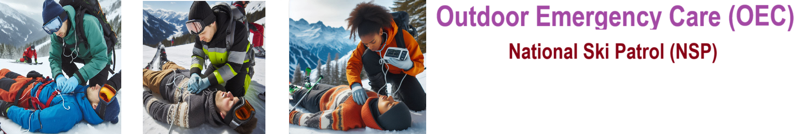

# Nsp Oec Training Chapter 18 - National Ski Patrol - Outdoor Emergency Care chapter 18
National Ski Patrol - Outdoor Emergency Care chapter 18

## Chapter 18: Principles of Trauma

1. Define mechanism of injury.
2. Define the five mechanisms of injury.
3. Describe why specific patients should be sent to a trauma center versus a community hospital.
4. Describe and demonstrate the management of a trauma patient.

## 18.1 Define mechanism of injury.

Mechanism of injury (MOI) refers to the specific force or event that causes trauma or injury to the body. It describes how the injury occurred, such as the type of force (blunt, penetrating, crushing) and the direction and intensity of that force. Understanding the MOI helps emergency responders and medical professionals predict potential injuries and determine appropriate treatment.

Examples of MOI:
- **Car accident**: The impact force from a collision may cause whiplash, fractures, or internal injuries.
- **Fall from height**: The vertical force of landing can result in broken bones, head injuries, or spinal trauma.
- **Gunshot wound**: A penetrating force that can cause damage to internal organs or tissues depending on the bullet’s path.

## 18.2 Define the five mechanisms of injury.

Here are the **five primary mechanisms of injury (MOI)**, which describe the types of forces that can cause trauma to the body:

1. **Blunt Trauma**:
   - Caused by a forceful impact without penetration of the skin. It can result in internal injuries, bruising, fractures, or organ damage.
   - **Example**: A car accident where the chest hits the steering wheel.

2. **Penetrating Trauma**:
   - Occurs when an object pierces the skin and enters the body, potentially damaging internal organs or tissues.
   - **Example**: A stab wound or gunshot injury.

3. **Burns**:
   - Injuries caused by heat, chemicals, electricity, or radiation. They can damage the skin, muscles, or deeper tissues depending on the severity.
   - **Example**: Thermal burns from fire or chemical burns from exposure to a toxic substance.

4. **Crush Injuries**:
   - Result from a body part being compressed between two objects, causing damage to tissues, muscles, and bones.
   - **Example**: A limb trapped under heavy machinery.

5. **Explosive/Blast Trauma**:
   - Injuries caused by the force of an explosion, which can result in both blunt and penetrating trauma, as well as burns. Blast waves can also cause internal injuries like ruptured organs or hearing loss.
   - **Example**: Injuries from a bomb or industrial explosion.

Each mechanism describes a different way that injury occurs, helping healthcare providers anticipate the types of trauma and necessary treatments.

## 18.3 Describe why specific patients should be sent to a trauma center versus a community hospital.

Specific patients should be sent to a **trauma center** rather than a community hospital because trauma centers are specially equipped and staffed to handle severe, complex, and life-threatening injuries. Here’s why:

1. **Specialized Care**: Trauma centers have highly trained trauma surgeons, emergency physicians, and specialized nursing staff who are experienced in managing critical injuries such as severe head trauma, spinal injuries, and multiple fractures.

2. **Advanced Diagnostic Tools**: Trauma centers are equipped with advanced imaging and diagnostic equipment (e.g., CT scans, MRIs) that can quickly assess internal injuries and guide rapid treatment.

3. **Surgical Capabilities**: Trauma centers have immediate access to operating rooms and specialized surgeons for urgent procedures, such as repairing internal bleeding, organ damage, or complex fractures.

4. **Multidisciplinary Teams**: Trauma centers have access to a broad range of specialists (e.g., neurosurgeons, orthopedic surgeons, cardiovascular surgeons), providing comprehensive care for injuries affecting multiple body systems.

5. **Higher Levels of Care**: Trauma centers are designated by levels (I-IV) based on their capabilities. Level I centers provide the highest level of trauma care, including rehabilitation, research, and continuous care for the most critically injured patients.

6. **Triage Guidelines**: Patients with specific injury patterns, such as penetrating trauma (e.g., gunshot wounds), traumatic brain injuries, or severe burns, are typically triaged to trauma centers because these facilities are better prepared to manage complex, high-risk cases.

### Examples of patients who should be sent to a trauma center:
- **Severe head or neck injuries**
- **Multiple or open fractures**
- **Gunshot wounds or stabbings**
- **Severe burns**
- **Crush injuries or amputations**
- **Patients in shock or with uncontrolled bleeding**

In contrast, **community hospitals** are suitable for less critical injuries and general care, but they may not have the immediate resources or specialized teams required for severe trauma. Sending critically injured patients directly to a trauma center improves survival rates and outcomes by ensuring they receive the most appropriate, timely care.

## 18.4 Describe and demonstrate the management of a trauma patient.

**Managing a trauma patient** involves a systematic approach to quickly assess, stabilize, and treat life-threatening injuries. The steps typically follow the **primary and secondary survey** process to ensure a comprehensive evaluation. Here’s how to manage a trauma patient:

### **1. Scene Safety and Initial Assessment:**
- **Ensure scene safety**: Make sure the scene is safe for both you and the patient.
- **Use personal protective equipment (PPE)**: Gloves, mask, or other gear as appropriate.
- **Establish responsiveness**: Check if the patient is conscious and responsive by tapping and speaking to them.

### **2. Primary Survey (ABCDE Approach):**
The primary survey focuses on identifying and treating life-threatening conditions.

- **A – Airway with cervical spine control**:
  - Check if the airway is clear and unobstructed.
  - If the patient is unresponsive, open the airway using the jaw-thrust maneuver to avoid moving the neck (assuming a possible spinal injury).
  - Insert an airway adjunct if necessary (e.g., an oropharyngeal airway).
  - Maintain **cervical spine stabilization** using manual inline stabilization or a cervical collar until a spinal injury is ruled out.

- **B – Breathing**:
  - Look, listen, and feel for breathing.
  - Assess the quality of breathing: rate, depth, and effort. 
  - Provide oxygen via a non-rebreather mask or assist with ventilation using a bag-valve mask if the patient isn’t breathing adequately.
  - Treat conditions such as **tension pneumothorax** with needle decompression if necessary.

- **C – Circulation with hemorrhage control**:
  - Check for a pulse and signs of adequate circulation (e.g., skin color, temperature).
  - Control major bleeding immediately with direct pressure, a tourniquet (if appropriate), or pressure dressings.
  - Treat for shock by elevating the legs (if no spinal injury) and keeping the patient warm.

- **D – Disability (Neurological Status)**:
  - Assess the patient’s level of consciousness using the **AVPU** scale (Alert, Verbal, Pain, Unresponsive) or the **Glasgow Coma Scale (GCS)**.
  - Check pupils for size, equality, and reaction to light.

- **E – Exposure and Environment**:
  - Fully expose the patient to assess for hidden injuries, but prevent hypothermia by covering the patient with blankets.
  
### **3. Secondary Survey (Head-to-Toe Examination):**
The secondary survey is performed after life-threatening conditions have been addressed.

- **Head and neck**: Check for head injuries, facial fractures, or neck wounds. Maintain cervical spine immobilization.
- **Chest**: Listen to lung sounds, check for rib fractures, penetrating wounds, or flail chest.
- **Abdomen**: Gently palpate for tenderness, rigidity, or signs of internal bleeding.
- **Pelvis**: Check for instability or pain (do not palpate aggressively if injury is suspected).
- **Extremities**: Assess for fractures, deformities, or circulation issues (pulses, capillary refill).
- **Back**: Log-roll the patient (with spinal precautions) to inspect the back for injuries or wounds.

### **4. Transport Decision**:
- **Rapid transport**: If the patient has significant injuries or requires immediate care beyond your capabilities, initiate rapid transport to a trauma center.
- Continue to monitor and reassess the patient during transport, especially for any changes in airway, breathing, circulation, or level of consciousness.

### **5. Ongoing Monitoring and Reassessment**:
- Continuously monitor **vital signs** (e.g., heart rate, respiratory rate, blood pressure, oxygen saturation).
- Reassess the patient’s ABCs regularly, especially if there is a deterioration in condition.

### **6. Communication with Receiving Facility**:
- Provide a concise report to the receiving trauma center or hospital, including the patient’s age, sex, MOI, injuries found, treatment provided, and vital signs.

### **Demonstration Example**:
1. You find a patient who has been in a car accident.
2. Ensure the scene is safe and introduce yourself.
3. Conduct a primary survey, starting with airway management, while stabilizing the cervical spine.
4. You find that the patient has severe bleeding from the leg, which you control using direct pressure and a tourniquet.
5. After stabilizing the airway, breathing, and circulation, you perform a head-to-toe assessment, identifying additional fractures.
6. Initiate rapid transport to a trauma center while continuously monitoring the patient's vital signs.

Following this structured approach ensures that life-threatening conditions are managed promptly and that no critical injuries are overlooked.

## Getting Started
To get started with the **Nsp Oec Training Chapter 18** solution repository, follow these steps:
1. Clone the repository to your local machine.
2. Install the required dependencies listed at the top of the notebook.
3. Explore the example code provided in the repository and experiment.
4. Run the notebook and make it your own - **EASY !**
    
## Solution Features
- Easy to understand and use  
- Easily Configurable 
- Quickly start your project with pre-built templates
- Its Fast and Automated

## Notebook Features
- **Self Documenting** - Automatically identifies major steps in notebook 
- **Self Testing** - Unit Testing for each function
- **Easily Configurable** - Easily modify with **config.INI** - keyname value pairs
- **Includes Talking Code** - The code can talk to you and explains itself  - seet talking_code = True
- **Self Logging** - Enhanced python standard logging   
- **Self Debugging** - Enhanced python standard debugging
- **Low Code** - or - No Code  - Most solutions are under 50 lines of code
- **Educational** - Includes educational dialogue and background material
    
## Deliverables or Figures
    
    

## Github    
## https://github.com/JoeEberle/ 

## Email 
## josepheberle@outlook.com 

    

    